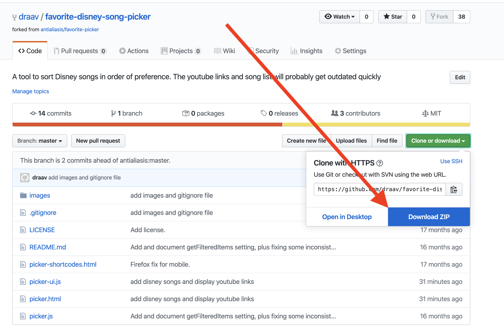
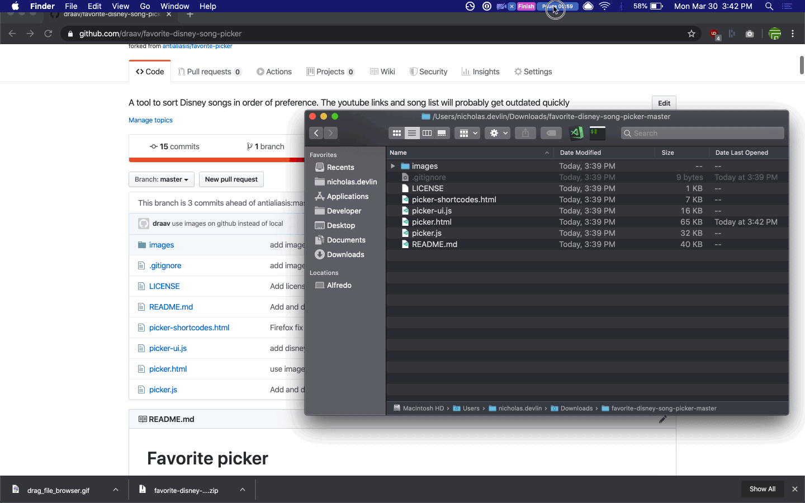

# Favorite Disney song picker

## Basic usage

Navigate to https://draav.github.io/favorite-disney-song-picker/ and have fun

## Overview 

This is a tool that allows users to pick songs repeatedly, until a single favorite is found, and then continue to pick for second place and so on, constructing a list. It is a specialization of the [Favorite Picker](https://github.com/antialiasis/favorite-picker). I changed the original formatting a bit and added a YouTube link for each song. The YouTube links will probably die soon because Disney. 

It will take about 20-60 choices to find your #1 favorite movie, depending on how many choices you select each round. You can keep choosing movies until you've sorted all 232, or just stop when you hit a top 5 or top 10.

Songs not included:

- anything from live action or pixar movies
- songs with no lyrics
- credits songs
- reprises
- songs not created specifically for the movie (e.g. Elvis songs in Lilo & Stitch)

**WARNING**: There is no history. If you refresh the browser, you will lose your progress. There is no option to save your progress or your results.

---

## How to run the site locally 

Download this repository as a zip folder. 

Unzip folder. Open `picker.html` in whatever internet browser you prefer. You can open the file either by dragging it onto your browser

Or you can right click the file and choose to `Open With` Chrome or Firefox or whatever you prefer.

